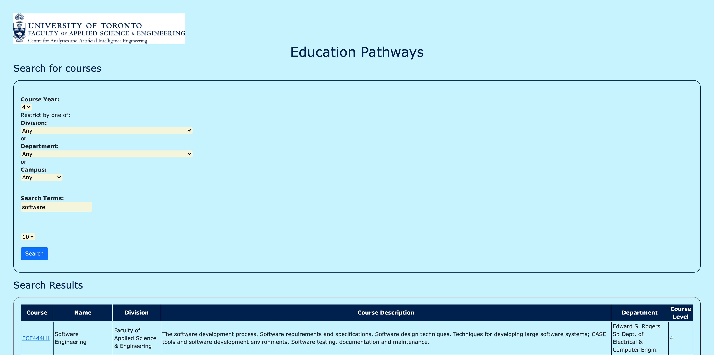
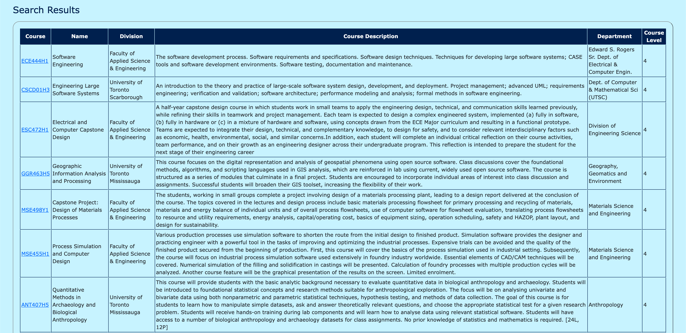

# CARTE Education Pathways
Name: Hannah Yi Jia Zhang
This repo is a clone of https://github.com/nelaturuk/education_pathways.git

# Lab 5

## Activity 1

## Activity 2-5
Home Page

Result Page - Form

Result Page - Result Table

## Activity 6
The Result page in the new UI is more user-friendly comparing to the old UI. The new styled UI provided a more organized result table by adding the boarder design and the sticky attribute names that would follow along when the user is scrolling the web page. In addtion, the text inside the column headers are centered so it's more readable comparing to the left-align headers in the old UI.